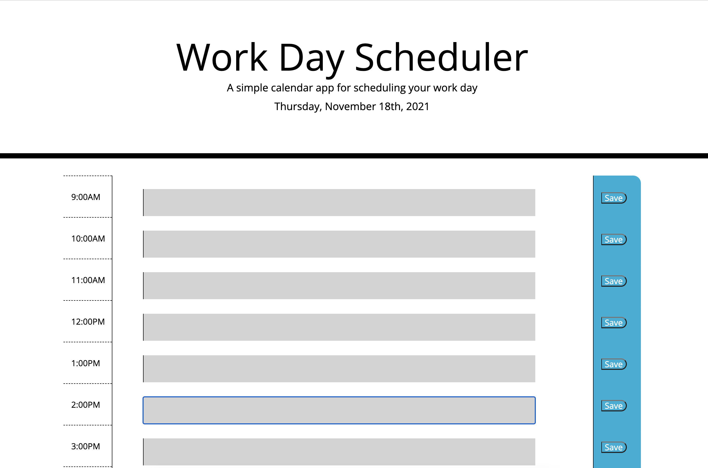

## Work Day Schedule Assignment

```
For this assignment, I built a custom work day schedule. In order to build it, I utilized a combination of div and row tags to fill out the skeleton of the webpage. I then incorporated the premade style.css sheet to the areas that corresponded best. I then added textarea tags to allow the user to add whatever text they wanted to the schedule. 
```

## Behind the Scenes
```
To get the schedule, and more specifically the textarea tags, to display the appropriate color, I created a function titled setColor() which contained an if - else if - else statement to compare the id values to the current time value. If the id value was less than the current time, the if statement would add the ".past" class, making the textarea background grey. If the values were equal, the if statement would remove the ".past" class and add the ".present" class, making the textarea background red. If the the id value was greater than the value of the current time, the if statement would remove the ".past" and ".present" classes and add the ".future" class, making the textarea background green.
```

## Building the Schedule
``` 
Once the user begins filling out the textarea for the respective hour segment, I linked the textarea value to the save button to store the value locally. I then created a function called getTasks() to pull the locally-stored information and keep it on the page when the user refreshes it.
```

## Links

GitHub Repository Link: https://github.com/MattReynolds53/Workday-Schedule

GitHub Pages Link: https://mattreynolds53.github.io/Workday-Schedule/


## Screenshots




